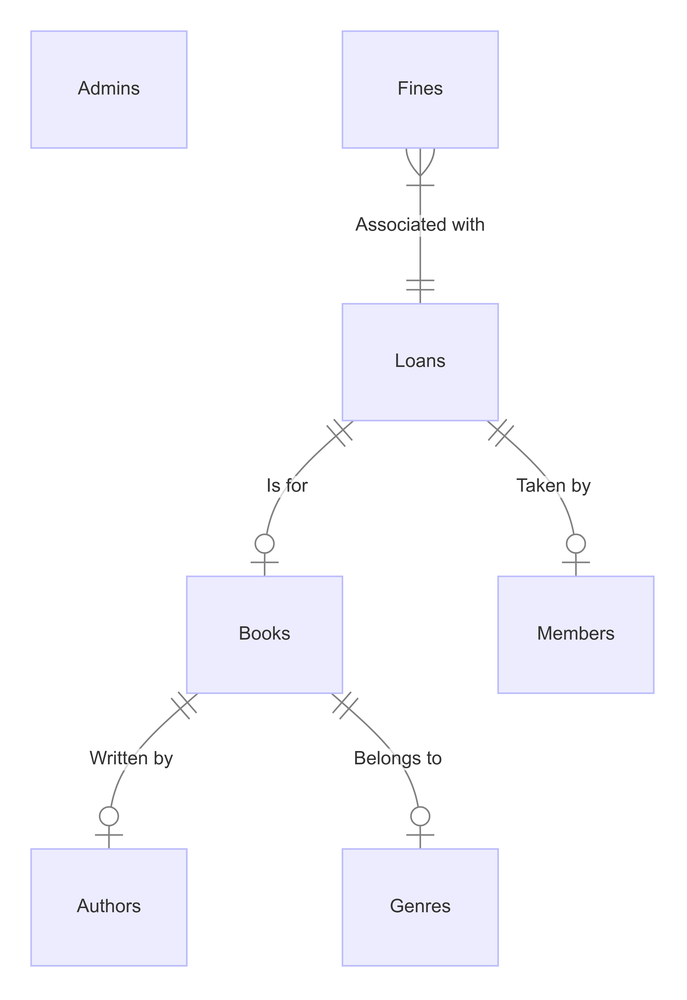

### Purpose
The purpose of this database is to efficiently manage a local library's inventory, loans, fines, Admins and member information.

### In Scope
- Books: Titles, genres, availability status (available or checked out).
- Authors: Names of authors.
- Genres: Categories of books.
- Members: Information about library members, including names, email addresses, phone numbers, and join dates.
- Admins: Information about library administrators, including names, email addresses, phone numbers, and positions.
- Loans: Records of books borrowed by members, including loan dates, due dates, and return dates.
- Fines: Records of fines incurred for overdue books, including the amount and payment status.

### Out of Scope
- Detailed financial transactions beyond fines.
- Detailed personal information beyond what's necessary for library operations.

## Functional Requirements

### User Capabilities
Users should be able to:
- Browse available books and their details.
- Borrow and return books.
- Pay fines for overdue books.
- Manage member and admin information.
- Generate reports on overdue books and fines collected.

### Out of Scope
- Online book reservations.
- Complex financial reporting beyond fine collection.

## Representation

### Entities

#### Books
- Attributes: BookID (Primary Key), Title, GenreID (Foreign Key), AuthorID (Foreign Key), ISBN, Availability.
- Types: INTEGER (BookID), TEXT (Title, ISBN), INTEGER (GenreID, AuthorID), INTEGER (Availability).
- Constraints: UNIQUE (ISBN), FOREIGN KEY (GenreID, AuthorID).

#### Authors
- Attributes: AuthorID (Primary Key), AuthorName.
- Types: INTEGER (AuthorID), TEXT (AuthorName).

#### Genres
- Attributes: GenreID (Primary Key), GenreName.
- Types: INTEGER (GenreID), TEXT (GenreName).

#### Members
- Attributes: MemberID (Primary Key), MemberName, Email, Phone, JoinDate.
- Types: INTEGER (MemberID), TEXT (MemberName, Email, Phone), DATE (JoinDate).
- Constraints: UNIQUE (Email).

#### Admins
- Attributes: AdminID (Primary Key), AdminName, Email, Phone, Position.
- Types: INTEGER (AdminID), TEXT (AdminName, Email, Phone, Position).
- Constraints: UNIQUE (Email).

#### Loans
- Attributes: LoanID (Primary Key), BookID (Foreign Key), MemberID (Foreign Key), LoanDate, DueDate, ReturnDate.
- Types: INTEGER (LoanID, BookID, MemberID), DATE (LoanDate, DueDate, ReturnDate).
- Constraints: FOREIGN KEY (BookID, MemberID).

#### Fines
- Attributes: FineID (Primary Key), LoanID (Foreign Key), FineAmount, Paid.
- Types: INTEGER (FineID, LoanID), REAL (FineAmount), INTEGER (Paid).
- Constraints: FOREIGN KEY (LoanID).

### Relationships

#### Entity Relationship Diagram

#### Relationships

- Books to Authors: Many-to-One (Each book is written by one author; each author may write multiple books).
- Books to Genres: Many-to-One (Each book belongs to one genre; each genre may have multiple books).
- Loans to Books: Many-to-One (Each loan is for one book; each book may have multiple loans).
- Loans to Members: Many-to-One (Each loan is taken by one member; each member may have multiple loans).
- Fines to Loans: One-to-One (Each fine is associated with one loan).

## Optimizations

### Indexes
- Index on "Books" table: GenreID, ISBN (for uniqueness).
- Index on "Members" table: Email (for uniqueness).
- Index on "Admins" table: Email (for uniqueness).
- Index on "Loans" table: BookID, MemberID (for quick retrieval of loan information).

### Views
- No views are currently implemented but could be considered for complex reporting needs in the future.

## Limitations

### Design Limitations
- The database may struggle with handling large volumes of simultaneous transactions during peak times.
- Complex financial transactions beyond fine collection are not supported.
- Detailed personal information beyond basic contact details and borrowing history is not stored.

### Functional Limitations
- Online reservation and payment systems are out of scope.
- Complex reporting requiring real-time analytics is not supported.

